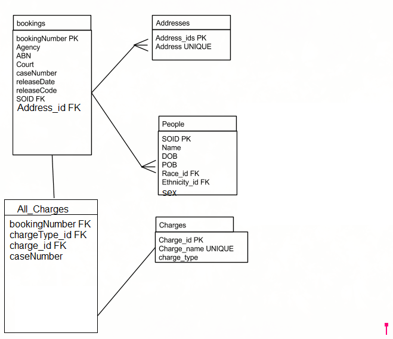

# normalization-7dbs

Authors: Richard Decal and Joe Comer

# Normalize the jail database:
  ## ER diagram of important entities.

  
  ## New db jail_norm_ComerDecal.db (readable by Noah + Dr Gillman), and create the tables for a jail db in 3rd normal form. Use all appropriate integrity constraints.

  ## Populate the new db

  1. Open jail.db.
  2. Attach your new db, giving it a schema name of jailnew.
  3. Now you can use table foo in the new db, as jailnew.foo.
	  
Rather than open jail.db and attach my new db, I opened my db and attached jail.db.

	$Sqlite3 jail_norm_ComerDecal.db
	=>attach '../Homelessness/Jail/jail.db' as jailnew;
	
Based on our E-R diagram, I created the bookings table with only the attributes that depend directly on the booking and only the booking.

    =>CREATE TABLE bookings(bookingNumber INT PRIMARY KEY, Agency VARCHAR, ABN INT, Court VARCHAR, releaseDate TIMESTAMP, releaseCode VARCHAR, SOID INT, 
    FOREIGN KEY(SOID) REFERENCES people(SOID));
    
Charges and addresses get their own tables with serial IDs as primary keys. A uniqueness constraint is needed for the actual values.

    =>CREATE TABLE charges(charge_id INTEGER PRIMARY KEY AUTOINCREMENT, charge_name VARCHAR UNIQUE);
    
    =>CREATE TABLE Addresses(Address_id INTEGER PRIMARY KEY AUTOINCREMENT, address VARCHAR UNIQUE);
    
Race is only a single character, and doesn't have many distinct values. I created a check constraint to ensure consistency, but an extra table seemed like overkill. Race depends only on people, so no 2NF violation. Same for ethnicity. SOID is the primary key because it uniquely indicates a person, and determines all the other attributes in this table. 

    =>CREATE TABLE people(SOID INT PRIMARY KEY, name VARCHAR, DOB TIMESTAMP, POB VARCHAR, Race CHAR(1) 
    CHECK (Race in ("A","B","I","U","W","a","b","w")), e CHAR(1) 
    CHECK (e IN ("H","N","U","h","n","u")));
    
chargeType and caseNumber are determined by a combo of bookingNumber and charge, so they are the primary key. They need to actually exist, though, so they get FK constraints.

    =>CREATE TABLE BookingsCharges(bookingNumber INT FORIEGN KEY REFERENCES bookings(bookingNumber), chargeType VARCHAR, charge_id FORIEGN KEY REFERENCES charges(charge_id), 
    PRIMARY KEY (bookingNumber,charge_id));
    
Now we add the data. Some addresses repeat, so we select distinct to avoid repetition.

    =>INSERT INTO addresses values(address) 
    SELECT DISTINCT address address 
    FROM jailnew.bookingsB;
    
All that's needed here is to pull the appropraite columns from the original bookingsB

    =>INSERT INTO bookings SELECT bookingNumber, Agency, ABN, Court, releaseDate, releaseCode, SOID 
    FROM jailnew.bookingsB;
    
SOIDs can repeat, but the other data should always stay the same (since a person's birthday, etc don't change,) so rouping by SOID makes sure we get only unique rows without losing any info from other columns.

    =>INSERT INTO people (SOID, name, DOB, POB, Race, e) 
    SELECT * FROM (select SOID, name, DOB, POB, race, e 
    FROM jailnew.bookingsB GROUP BY SOID);
    
I left join booking_addl_charges with charges (left join so that no info is lost from the former), matching by the name of the charge. This lets me insert charge IDs that match the charge for each row in booking_addl_charge.

    =>INSERT INTO BookingsCharges(bookingNumber, chargeType, charge_id) 
    SELECT bookingNumber, chargeType, charge_id FROM (select a.bookingNumber, a.chargeType, b.charge_id 
    FROM jailnew.booking_addl_charge a 
    LEFT JOIN charges b ON a.charge = b.charge_name);
	
This is basically the same command, but from bookingsB to get the primary charge for each bookingNumber.

    =>INSERT INTO BookingsCharges(bookingNumber, chargeType, charge_id) 
    SELECT bookingNumber, chargeType, charge_id 
    FROM (select a.bookingNumber, a.chargeType, b.charge_id FROM jailnew.bookingsB a 
    LEFT JOIN charges b ON a.charge = b.charge_name);

#  normalize the fanfiction db
## 1. Put fanfiction.stories into 2nd normal form (which implies 1st normal form). To keep url as primary key you’ll need to create a new table. starringchars isn’t the only problem. You’ll probably want to read the Postgres docs on string functions.

We need to unnest the starring characters and genres. To do this, we put characters and genres into their own tables. To relate our stories table to the characters and genres, we make a starring_characters and genreness table:

Technically speaking, we could assign URL as our primary key and stay in 2nd normal form. However, that would be cumbersome. I am moving URLs to their own table and using url_id as the primary key in stories:

    CREATE TABLE urls AS (SELECT DISTINCT url FROM stories_orig);

    ALTER TABLE urls ADD COLUMN url_id SERIAL;

Creating genres:

    CREATE TABLE genres AS (SELECT DISTINCT  unnest(string_to_array(genre,'/')) genre FROM stories_orig);

    ALTER TABLE genres ADD COLUMN genre_id SERIAL;

    ALTER TABLE genres ADD PRIMARY KEY (genre_id);

Creating characters:

    CREATE TABLE characters AS (SELECT DISTINCT unnest(string_to_array(rtrim(starringchars), ' & ')) character_name FROM stories_orig);

    ALTER TABLE characters ADD COLUMN character_id SERIAL;

    ALTER TABLE characters ADD PRIMARY KEY (character_id);

Creating starringchars:

    CREATE TABLE starringchars 
    AS (SELECT url url_id, unnest(string_to_array(rtrim(starringchars), ' & ')) character_id 
    FROM stories_orig);

Replace URL string with the url_id we made earlier

    UPDATE starringchars SET url_id = urls.url_id
    FROM urls
    WHERE urls.url = starringchars.url_id;

Replace character names with the character_id we made earlier:

    UPDATE starringchars 
    SET character_id = characters.character_id
    FROM characters
    WHERE starringchars.character_id = characters.character_name;

Creating genreness:

    CREATE TABLE genreness 
    AS (SELECT url, unnest(string_to_array(genre,'/')) genreness 
    FROM stories_orig);

Replace URLs with their id:

    UPDATE genreness SET url = urls.url_id
    FROM urls
    WHERE urls.url = genreness.url;

Replace genres with their ID:

    UPDATE genreness 
    SET genreness = genres.genre_id
    FROM genres
    WHERE genres.genre = genreness.genreness;

Finally, we will replace URL in our stories table with url_id:

    CREATE TABLE stories AS (
    SELECT urls.url_id, rating , updated, favorites,  chapters, complete, collectedinfo, description, language, author, follows, title, reviews, published, words
    FROM stories_orig
    JOIN urls ON urls.url = stories_orig.url
    );

## Seven Databases, Chapter 2, Days 1 and 2 homework.
###   1. Section 2.2, Find problem 3.
   
MATCH FULL is a restraint on foreign keys consisting of more than one column, establishing that either both columns must have non-null values, or both must have null values.

###   2i

     SELECT relname FROM pg_class 
     WHERE relname IN ('countries','cities','venues','events');
### 2ii

    SELECT c.country_name FROM venues v 
    JOIN countries c ON  v.country_code = c.country_code JOIN events e 
    ON v.venue_id = e.venue_id;
    
###3iii
	ALTER TABLE venues ADD active boolean default TRUE;

### 3. Section 2.3, Do problem 2.
   
        SELECT * FROM crosstab( 'SELECT extract(year from starts) 
        AS year, extract(month from starts) 
        AS month, count(*) FROM events GROUP BY year, month',;
        
        'SELECT * FROM generate_series(1,12)' ) 
        AS ( year int, jan int, feb int, mar int, apr int, may int, jun int, jul int, aug int, sep int, oct int, nov int, dec int ) 
        ORDER BY YEAR;

